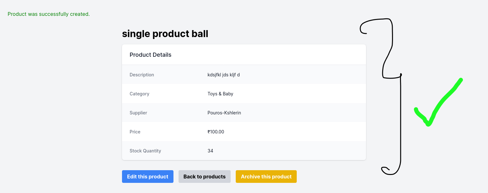
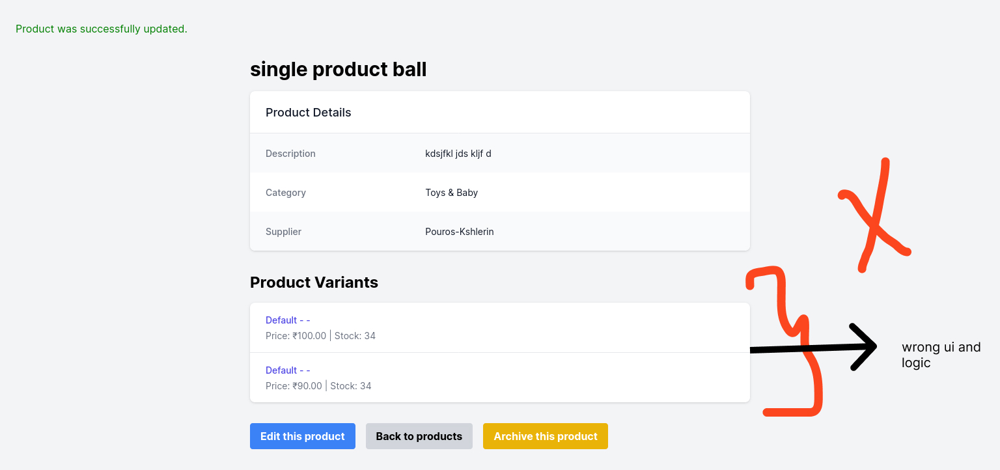

# Inventory management app

# App Checklist

## 🚀 App Working Checklist

- **Product Add**
  - With Variants ✅
  - Without Variants ✅
- **Soft Delete (archive) & Restore** ✅
  - View (archive page)
- **Edit Product**

  - With Variants ✅
  - Without Variants ❌

- **Billing Calculator** ✅

- **Sales History** ✅
  - When a product is soft deleted, in the sales history page the deleted product is shown with '(deleted)'

## 🐞 Not Working / Bugs

- **Edit Product without Variants** ❌
  - **Issue**: After editing a product without variants, product creates another variant, and updates database. On the billing page, when this product is selected, it shows the new variant options. For example, if I edit only the title, it duplicates the product_variants (size/color/ material ("default" value) and price, and stock_quantity) with the same values. When I edit the price or stock, it creates another variant with the new values, but the original product_variants values remain uneditable and can't be removed.

---

### 💡 Image Upload

- **Correct UI before editing product without variants**
  

  👆 This is the correct solution for a product without variants, even after edited.

- **WRONG UI after editing product without variants**
  
